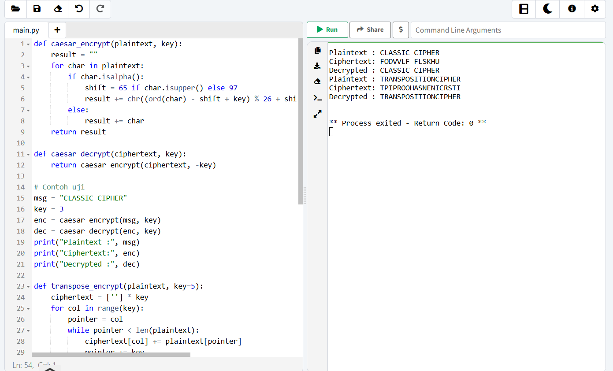

# Laporan Praktikum Kriptografi
Minggu ke-: 5 
Topik: Cipher Klasik (Caesar, Vigenère, Transposisi)
Nama: Fausan Dika Kusuma
NIM: 230202752
Kelas: 5 IKRB  

---

## 1. Tujuan
Setelah mengikuti praktikum ini, mahasiswa diharapkan mampu:
1.Menerapkan algoritma Caesar Cipher untuk enkripsi dan      dekripsi teks.
2.Menerapkan algoritma Vigenère Cipher dengan variasi kunci.
3.Mengimplementasikan algoritma Transposisi sederhana.
4.Menjelaskan kelemahan dari algoritma kriptografi klasik.

---

## 2. Dasar Teori
Cipher klasik merupakan metode kriptografi awal yang digunakan untuk mengamankan pesan dengan teknik sederhana seperti substitusi dan transposisi. Pada cipher substitusi, setiap huruf pada plaintext digantikan dengan huruf lain berdasarkan pola tertentu (misalnya pada Caesar dan Vigenère Cipher). Sedangkan pada cipher transposisi, urutan karakter dalam pesan diubah berdasarkan kunci tertentu tanpa mengganti huruf itu sendiri.

Caesar Cipher bekerja dengan menggeser huruf pada plaintext sejauh nilai kunci tertentu. Contoh: dengan kunci 3, huruf A akan menjadi D.
Vigenère Cipher adalah pengembangan dari Caesar Cipher yang menggunakan kunci berupa kata (misalnya “KEY”) untuk menentukan besar pergeseran tiap huruf.
Transposisi Cipher mengacak posisi huruf berdasarkan panjang kunci tertentu, misalnya dengan membaca huruf secara kolom.

Walaupun sederhana, cipher klasik memiliki kelemahan utama yaitu mudah diserang menggunakan analisis frekuensi karena pola huruf masih dapat dikenali dari ciphertext.

---

## 3. Alat dan Bahan
Python 3.11
Visual Studio Code
Git dan akun GitHub
Sistem Operasi Windows 10/11
Folder kerja: praktikum/week5-cipher-klasik/

---

## 4. Langkah Percobaan
1. Membuat folder praktikum/week5-cipher-klasik/ dengan struktur sesuai panduan.
2. Membuat file src/caesar.py, src/vigenere.py, dan src/transpose.py.
3. Menyalin kode program dari modul praktikum ke masing-masing file.
4. Menjalankan program menggunakan perintah:
5. Menyimpan hasil tangkapan layar pada folder screenshots/.
6. Membuat laporan laporan.md dan melakukan commit ke repository GitHub
---

## 5. Source Code
(Salin kode program utama yang dibuat atau dimodifikasi.  
Gunakan blok kode:

```python
def caesar_encrypt(plaintext, key):
    result = ""
    for char in plaintext:
        if char.isalpha():
            shift = 65 if char.isupper() else 97
            result += chr((ord(char) - shift + key) % 26 + shift)
        else:
            result += char
    return result

def caesar_decrypt(ciphertext, key):
    return caesar_encrypt(ciphertext, -key)

# Contoh uji
msg = "CLASSIC CIPHER"
key = 3
enc = caesar_encrypt(msg, key)
dec = caesar_decrypt(enc, key)
print("Plaintext :", msg)
print("Ciphertext:", enc)
print("Decrypted :", dec)

def transpose_encrypt(plaintext, key=5):
    ciphertext = [''] * key
    for col in range(key):
        pointer = col
        while pointer < len(plaintext):
            ciphertext[col] += plaintext[pointer]
            pointer += key
    return ''.join(ciphertext)

def transpose_decrypt(ciphertext, key=5):
    num_of_cols = int(len(ciphertext) / key + 0.9999)
    num_of_rows = key
    num_of_shaded_boxes = (num_of_cols * num_of_rows) - len(ciphertext)
    plaintext = [''] * num_of_cols
    col = 0
    row = 0
    for symbol in ciphertext:
        plaintext[col] += symbol
        col += 1
        if (col == num_of_cols) or (col == num_of_cols - 1 and row >= num_of_rows - num_of_shaded_boxes):
            col = 0
            row += 1
    return ''.join(plaintext)

# Contoh uji
msg = "TRANSPOSITIONCIPHER"
enc = transpose_encrypt(msg, key=5)
dec = transpose_decrypt(enc, key=5)
print("Plaintext :", msg)
print("Ciphertext:", enc)
print("Decrypted :", dec)

```
)

---

## 6. Hasil dan Pembahasan
(- Lampirkan screenshot hasil eksekusi program (taruh di folder `screenshots/`).  
- Berikan tabel atau ringkasan hasil uji jika diperlukan.  
- Jelaskan apakah hasil sesuai ekspektasi.  
- Bahas error (jika ada) dan solusinya. 

Hasil eksekusi program Caesar Cipher:




)

---

## 7. Jawaban Pertanyaan
1. Apa kelemahan utama algoritma Caesar Cipher dan Vigenère Cipher?
Kelemahan Caesar Cipher adalah ruang kuncinya kecil (hanya 25 kemungkinan pergeseran) sehingga mudah dipecahkan dengan brute force.
Kelemahan Vigenère Cipher adalah pola kunci yang berulang dapat dianalisis dengan metode Kasiski atau Friedman test, sehingga juga rentan terhadap analisis frekuensi.

2. Mengapa cipher klasik mudah diserang dengan analisis frekuensi?
Karena distribusi huruf dalam ciphertext masih mengikuti pola statistik bahasa asli. Huruf yang paling sering muncul pada ciphertext biasanya mewakili huruf yang paling sering muncul dalam bahasa (misalnya huruf “E” dalam bahasa Inggris).

3. Bandingkan kelebihan dan kelemahan cipher substitusi vs transposisi.

 Cipher substitusi mengganti huruf dengan huruf lain, sedangkan transposisi hanya mengubah posisi huruf.

 Substitusi mudah dikenali pola frekuensinya, sementara transposisi lebih sulit namun masih bisa dianalisis struktur katanya.

 Kombinasi keduanya dapat meningkatkan keamanan (contohnya digunakan pada cipher modern seperti AES yang menggabungkan substitusi dan permutasi).
---

## 8. Kesimpulan
Dari praktikum ini, dapat disimpulkan bahwa cipher klasik seperti Caesar, Vigenère, dan Transposisi merupakan dasar dari kriptografi modern. Walaupun sederhana dan mudah diimplementasikan, algoritma ini memiliki kelemahan besar terhadap analisis frekuensi dan brute force, sehingga tidak cocok digunakan untuk keamanan data modern.

---

## 9. Daftar Pustaka
Stallings, W. (2017). Cryptography and Network Security: Principles and Practice. Pearson Education.
Katz, J., & Lindell, Y. (2020). Introduction to Modern Cryptography. CRC Press.
Kurose, J. F., & Ross, K. W. (2021). Computer Networking: A Top-Down Approach.

---

## 10. Commit Log
(Tuliskan bukti commit Git yang relevan.  
Contoh:
```
commit c5237d905c4c476678409ba489feb66437697051 (HEAD -> main, origin/main, origin/HEAD)    
Author: FAUSANDIKAKUSUMA <fauzandikakusuma@gmail.com>   
Date:   Tue Nov 11 21:02:14 2025 +0700  
    week5-cipher-klasik 

    week5-cryptosystem: implementasi Caesar Cipher dan laporan )
```
